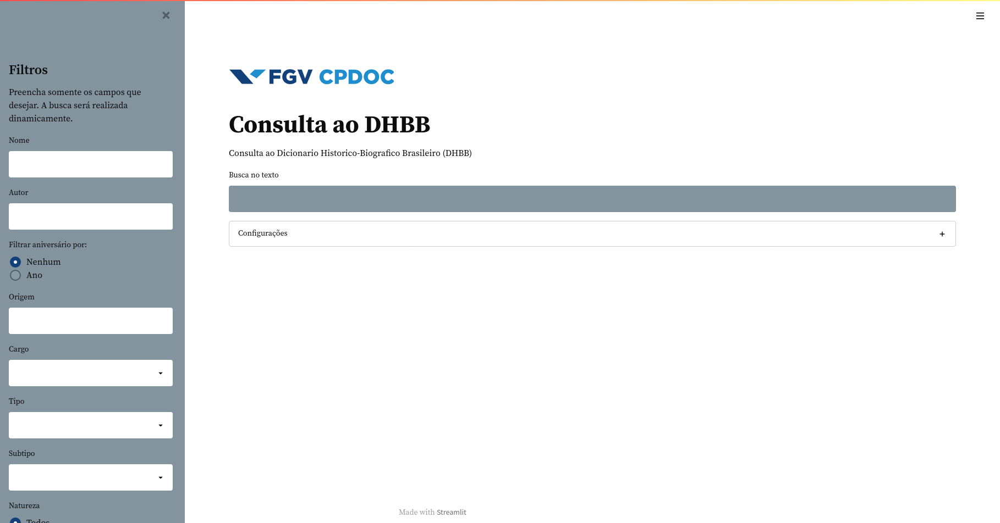

# Recuperação de Documentos

Para replicar o programa siga os passos em [Documentacao](https://github.com/liviameinhardt/Document-Search/blob/5a484ec81377bb0a51219870a15b352e2f039249/Documentacao.md)

## Objetivo

  O [demo](http://dhbb.mybluemix.net/dhbb/home) atual tem como [backend](https://en.wikipedia.org/wiki/Frontend_and_backend) o sistema [Elastic Search](http://elastic.co) baseado no
  [Lucene](https://lucene.apache.org).  Assim, o objetivo do projeto foi estudar, instalar e
  indexar os dados do DHBB no Elastic Search, de forma a permitir consultas como:

  1. documentos que contenham 'Alzira' no campo =autor=
  2. documentos que a pessoa tenha nascido no ano de 1944 (campo
     =birthdate=)
  3. documentos que a pessoa tenha nascido no estado do RJ (campo
     =birthplace=)
  4. documentos cuja pessoa tenha sido dep. (deputado) (campo
     =cargos=)
  5. documentos que contenham a palavra 'professor' no =text=
  6. documentos que contenham a palavra 'faculdade' e 'medicina' no
     mesmo parágrafo ou sentença (campo =text=).

  Isto é, queremos permitir buscas por tokens nos campos 'autor',
  'cargos', 'birthplace', 'birthdate' e minimamente buscas [boleanas](https://nlp.stanford.edu/IR-book/pdf/01bool.pdf) no
  campo 'text'.

  A interface do programa final:



##  Dados

Anteriormente, desenvolvemos a extração de algumas informações  sobre os verbetes do DHBB. Se juntarmos os arquivos do [DHBB](http://github.com/cpdoc/dhbb) com os dados extraídos, temos agora para cada verbete:

 ``` yaml
    document   : 10
    name       : Armando Abílio Vieira
    birthplace : Itaporanga (PB)
    birthdate  : 29/12/1944
    parents    :
      - Argemiro Abílio de Sousa
      - Luísa Bronzeado Vieira
    title      : ABÍLIO, Armando
    natureza   : biográfico
    sexo       : m
    cargos     :
     - dep. fed. PB 1995-1999
     - dep. fed. PB 1999-2003
     - dep. fed. PB 2007-2011
     - dep. fed. PB 2012
    autor      :
     - Alan Carneiro
     - Demian Melo (atualização)
    text       : >-
      «Armando Abílio Vieira» nasceu em Itaporanga (PB) no dia 29 de
      dezembro de 1944, filho de Argemiro Abílio de Sousa e de Luísa
      Bronzeado Vieira.

      Em 1962 ingressou, em Recife, na Faculdade de Ciências...
```

  Temos 7709 verbetes no DHBB sendo aproximadamente 6746 biográficos
  (sobre pessoas):

 ``` bash
    % egrep -c "natureza:[ ]*biográfico[ ]*$" *.text | awk -F ':' '{print $2}' | sort | uniq -c
     963 0
    6746 1
```

  Sobre os verbetes temáticos, só temos a estrutura:

 ```yaml
    title    : INSTITUTO NACIONAL DE PREVIDÊNCIA SOCIAL (INPS)
    natureza : temático
    tipo     :
      - Organização
    subtipo  :
      - Empresa
    autor    :
       - Alzira Alves de Abreu
    text     : >-
      Órgão criado pelo Decreto nº 72, de 21 de novembro de 1966 ...
```

  Neste projeto, queremos desenvolver uma interface de busca sobre
  estes dados.


